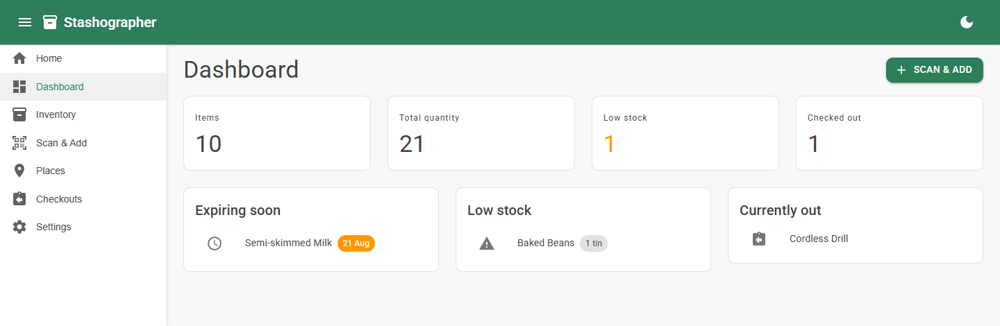
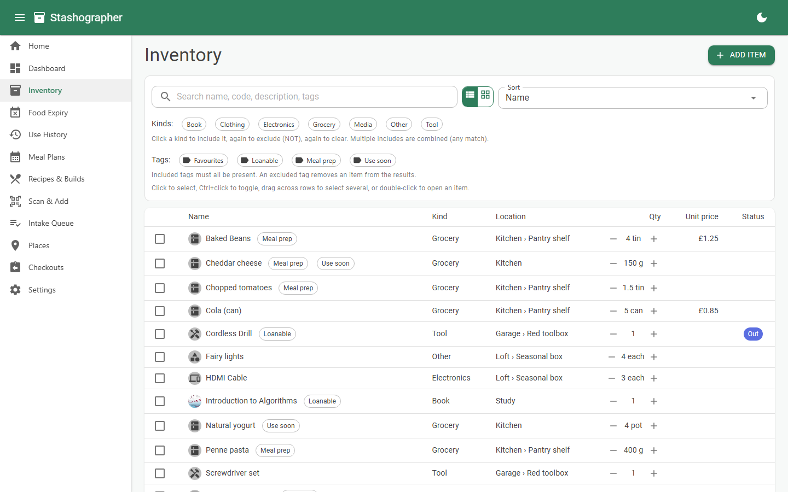
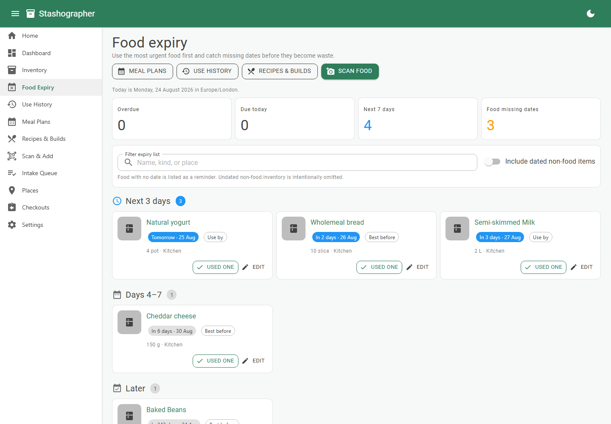
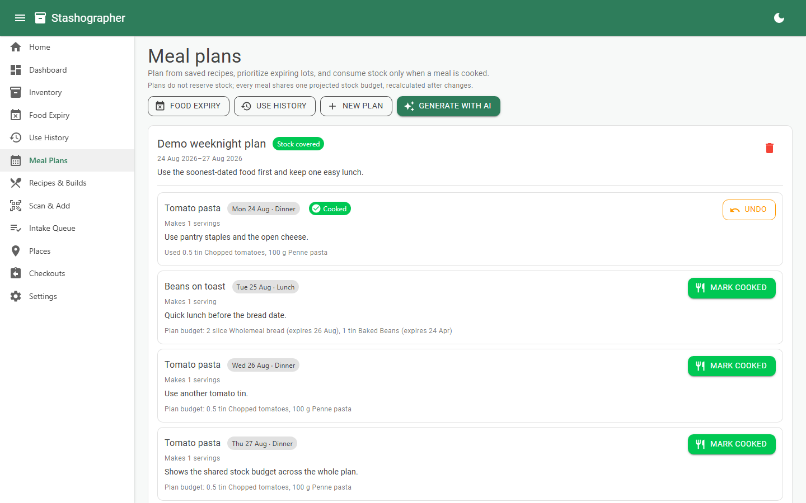
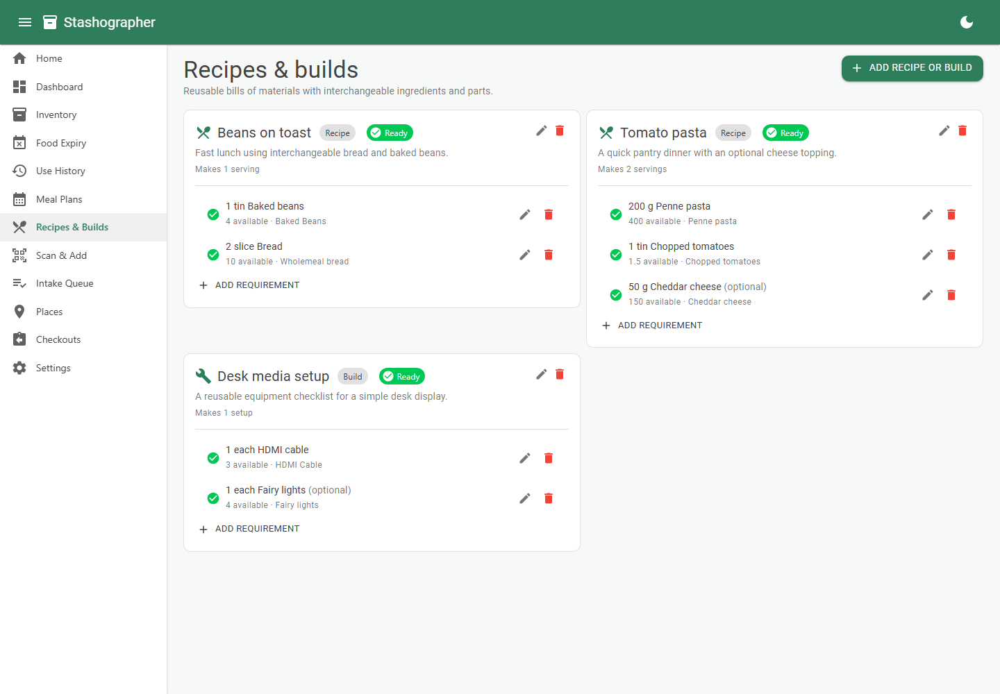
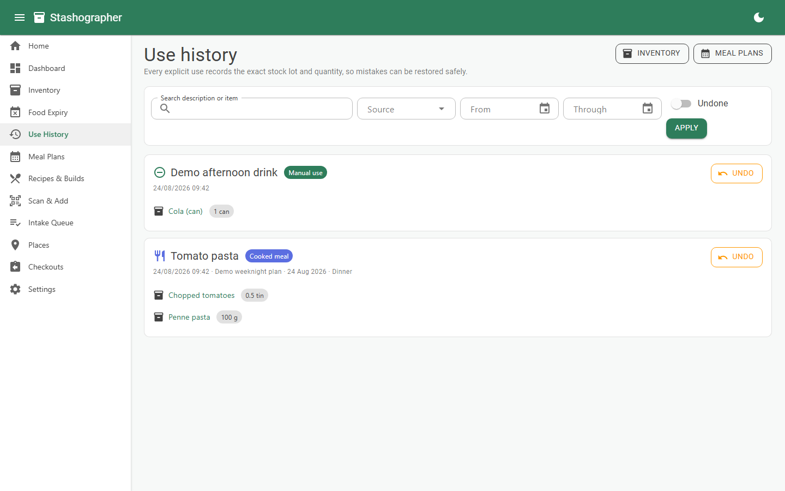
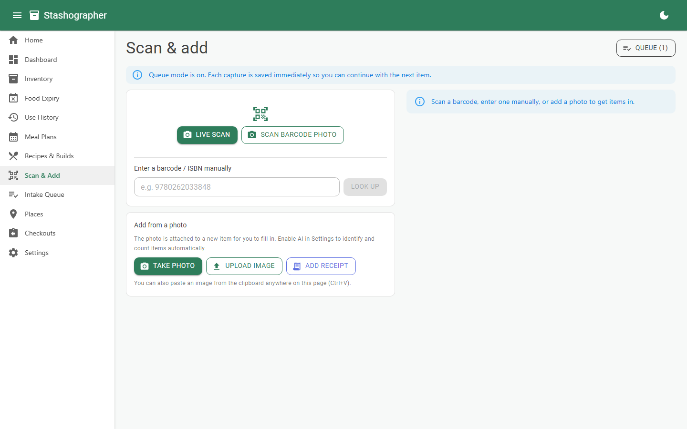
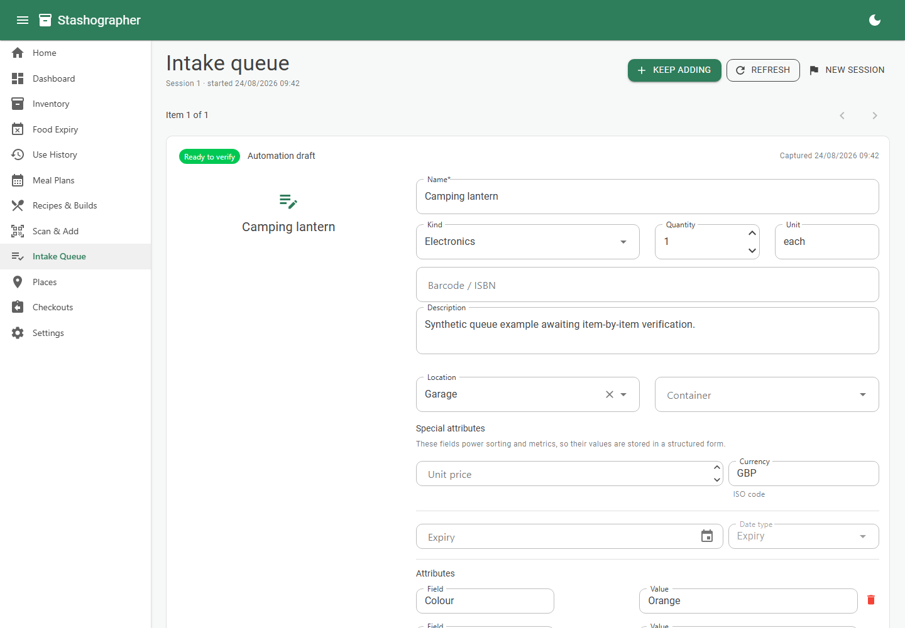
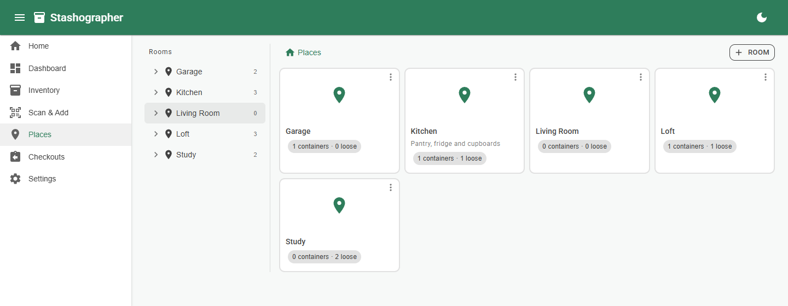
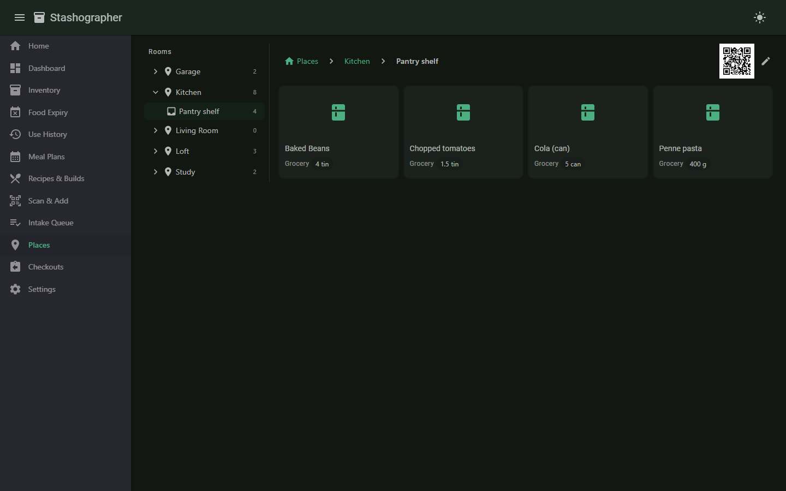

# Stashographer

[](https://github.com/Wixely/Stashographer/actions/workflows/ci.yml)
[](https://github.com/Wixely/Stashographer/actions/workflows/docker.yml)
[](LICENSE)
[](https://dotnet.microsoft.com/)

A household inventory manager. Scan a barcode, ISBN, or QR code (or type it in) and
Stashographer auto-fills the details from free public APIs — or, optionally, an AI vision
model — then tracks quantity, where each thing lives (room → container), expiry dates, and
who currently has it on loan.

Self-hosted, single container, SQLite on a volume. No cloud account and no telemetry; one local
administrator password protects configuration.

## Screenshots

All screenshots use the repository's wholly synthetic Development sample data.

| Dashboard | Inventory |
|---|---|
|  |  |

| Food expiry | Meal plans |
|---|---|
|  |  |

| Recipes & builds | Use history |
|---|---|
|  |  |

| Scan & add | Intake queue |
|---|---|
|  |  |

| Places (dark theme) | Container (dark theme) |
|---|---|
|  |  |

## Features

- **Any kind of item** — groceries, books, tools, electronics, clothing, or anything else,
  with flexible per-item attributes.
- **Typed special attributes** — price is stored as a numeric unit price plus ISO currency,
  and expiry as an operational date with use-by/best-before metadata. These stay separate
  from ordinary text attributes so inventory features can sort, aggregate, and alert on them.
- **Barcode & ISBN lookup** — [Open Food Facts](https://world.openfoodfacts.org) for
  groceries and [Open Library](https://openlibrary.org) for books, routed automatically by
  the code's shape.
- **Camera scanning** via the browser-native `BarcodeDetector`, with manual entry always
  available (also works with USB keyboard-wedge scanners). On LAN HTTP or browsers without
  that API, a rear-camera still-photo fallback decodes locally on the server. Queue-mode live
  scanning keeps the camera open, shows a configurable cooldown between reads, and turns a
  deliberate consecutive read of the same barcode into one editable quantity.
- **Fully manual item entry** — **Add manually** on Scan & add opens a blank item form without
  requiring a barcode, image, AI processing, or an intake-queue capture.
- **Queue-first intake** — photos and barcodes are persisted immediately so the next item
  can be captured without waiting. A photo containing several objects is split by default
  into individual, focused crops and queue entries. A sequential worker uses earlier session
  items as context, and the review queue presents every suggestion for item-by-item acceptance
  or correction. Mobile file and camera selections upload through a circuit-independent HTTP
  path, so suspending the browser picker cannot strand the photo during a Blazor reconnect.
- **Batch photo selection** — in queue mode, the Scan page accepts multiple images from one
  gallery/file-picker action and camera apps that support multi-capture. Every selected image
  receives its own durable, idempotent upload and queue entry. Mobile camera apps that return
  only one shot cannot be forced to remain open by a webpage; use **Take photos** again for the
  next shot. Immediate-validation mode intentionally remains single-image so one capture is
  confirmed before another replaces it.
- **Automatic photo framing** — AI bounding boxes produce a focused, square-ish crop for each
  detected object. Explicit single-item captures crop around the dominant object and fall back
  to the original photo when no reliable bound is available.
- **Multi-view item images** — attach front, back, label, detail, and shared receipt images
  without changing quantity. AI crops retain their source-image relationship and exact crop
  region, so the untouched original remains available when a crop needs correcting.
- **Purchase-evidence enrichment** — ordinary photo capture automatically recognizes paper
  receipts, invoices, and screenshots of completed orders, then extracts merchant, date,
  currency, totals, and purchase lines for conservative line-to-item matching. One sanitized
  image can be shared by several stock lots with durable provenance; accepting purchase
  evidence never changes stock counts. A manual receipt/order override and reclassification
  controls remain available when the model is wrong.
- **Same-object capture safety** — the vision agent compares each photo with recent session
  captures using instance-specific evidence such as wear, labels, and surrounding context.
  Confident additional views become zero-quantity image attachments; uncertain same-product
  photos cannot auto-increment and require an explicit “same item” or “another copy” choice.
- **Locations & containers** — put items in a room or inside a box/shelf/drawer/bin. Each
  container gets a **printable QR code**; scan it to see what's (meant to be) inside.
- **Fast placement** — queue review remembers recent location/container targets, while the
  inventory supports multi-selection and Quick Move from either the toolbar or context menu.
- **Reusable tags** — label an item with any number of centrally managed tags, search by tag,
  and combine must-have and excluded tag filters in either the list or gallery inventory view.
  Tags follow an item when its quantity is split into another place or expiry lot.
- **Stock lots and split quantities** — each inventory entry is homogeneous by place and
  expiry. Split a product across rooms/containers or keep cans with different dates as linked,
  independently usable stock entries. Product counts and low-stock checks remain collection-aware.
- **Checkout / lending** — record who took an item and where, and check it back in later.
- **Dashboard** — low stock, expiring soon, and currently checked-out at a glance.
- **Food expiry workflow** — overdue, today, next-three-day, weekly, and later views use
  the configured local date. Quickly decrement used items and find food whose expiry date
  still needs recording; dated non-food items can be included when useful.
- **Reversible use history** — quick manual decrements and cooked meals share one durable
  event log with exact stock-lot, quantity, unit, and expiry snapshots. Filter the history,
  inspect it from an item, and safely Undo while the original lots still exist.
- **Recipes & builds (BOMs)** — define reusable outputs and their required ingredients or
  parts. Requirements can use generic kind/text/attribute selectors or a durable explicit
  allow-list of interchangeable inventory items; allocation avoids double-counting stock.
  A configured AI agent can draft the complete requirement list from a natural-language
  request and current inventory context, with an editable review before anything is saved.
- **Expiry-aware meal plans** — manually plan from saved recipes or have the configured AI
  agent draft a reviewable plan that prioritizes dated food. Plans never reserve or change
  stock. Marking a meal cooked explicitly consumes exact lots earliest-expiry-first, records
  the event, and supports restoring those same lots with Undo. A deterministic whole-plan
  budget prevents meals from double-counting ingredients and derives an aggregate shopping
  list with the meal and date responsible for each gap.
- **AI enrichment (optional)** — identify an item from a photo when a barcode won't do, and
  "season" any item with extra detail, via any **OpenAI-protocol** endpoint.
- **Agent API & MCP (optional)** — deployment-gated, administrator-activated automation can
  search inventory, inspect places, consumption history and queue context, and propose or refine
  item drafts through
  `/api/v1` or stateless Streamable HTTP MCP. Human item-by-item acceptance remains mandatory
  for automation drafts.
- **Light / dark themes**, mobile-friendly (MudBlazor).

## Quick start

### Docker Compose (recommended)

```bash
docker compose up -d --build
```

Then open <http://localhost:8080>. A sample [`docker-compose.yml`](docker-compose.yml) is
included — the database and images live on the `stash-data` volume, so `docker compose down`
keeps your data. Settings use the convenience administrator password `admin`; set
`STASHOGRAPHER_ADMIN_PASSWORD` in `.env` to replace it.

### Docker

```bash
docker build -t stashographer .
docker run -d -p 8080:8080 -v stash-data:/data \
  -e STASHOGRAPHER_ADMIN_PASSWORD=replace-me stashographer
```

The image runs unprivileged (UID 1654) and exposes a `/health` endpoint used by its
`HEALTHCHECK`. If you swap the named volume for a bind mount, `chown 1654` the host directory
first — bind mounts keep the host's ownership, so the app cannot write to it otherwise.

### From source

```bash
dotnet run --project src/Stashographer
```

Migrations apply automatically on startup and the SQLite file (`stashographer.db`) is created
next to the app. Open the printed URL.

## Administrator access

Household inventory workflows remain directly available. **Settings** requires an administrator
session, using `STASHOGRAPHER_ADMIN_PASSWORD`; the checked-in development and Docker convenience
default is `admin`. Sign-in uses a rate-limited, antiforgery-protected form and a 12-hour
HTTP-only, same-site cookie (marked Secure when served over HTTPS). Set a private runtime value
before treating it as a security boundary. Changing the password and restarting invalidates
existing sessions. See
[`docs/administration.md`](docs/administration.md) for deployment and cookie-key details.

## API and MCP automation (optional)

API and MCP are disabled by default. Enable their deployment flags, then use the protected
Settings page to generate one-time-visible bearer keys and activate the surfaces. The API
always requires a key; MCP can deliberately be keyless on a trusted network or use a separate
rotatable key. Both transports share the same review-safe operations, and neither exposes an
accept/reject action. See [`docs/automation.md`](docs/automation.md) for activation, endpoint
and tool reference, examples, and audit behavior.

## Enable AI (optional)

Configure it in **Settings → AI enrichment** — endpoint, API key and models are saved to the
app database and apply immediately (no restart; works inside Docker). Any OpenAI-compatible
endpoint works (OpenAI, Azure OpenAI, Ollama, LM Studio, …).

Environment variables provide the initial defaults until settings are saved in the UI:

```bash
Ai__Enabled=true
Ai__ApiKey=sk-...
Ai__Model=gpt-4o-mini
Ai__VisionModel=gpt-4o           # optional, for photo identify/detect/match
Ai__Endpoint=https://your-endpoint/v1   # optional
```

Without AI configured, those actions are simply hidden and everything else works.

For local development, `appsettings.Development.json` is preconfigured for Qwen Studio at
`http://localhost:12345/v1`, using the vision-capable `qwen3.6-27b-mtp@q6_k_xl` for both
text and photos. Settings saved in the database still take precedence. When Stashographer
runs in Docker and Qwen Studio runs on the Windows host, use
`http://host.docker.internal:12345/v1` instead.

## Intake workflow

The intake queue is enabled by default. Barcode scanners can enter a code and press Enter;
the field clears and regains focus as soon as the capture is stored. Photos can be taken,
uploaded, or pasted from the clipboard anywhere on the Scan page with Ctrl+V. In queue mode,
the photo controls accept multiple files from supporting camera apps and gallery pickers;
every image is stored as its own durable queue entry. Gallery multi-select is reliable where
the picker exposes it; many mobile camera apps still return only one shot, in which case tap
**Take photos** again. Queue-disabled immediate validation remains single-image. Processing
runs in capture order, which lets the model use recent item kinds, attributes, and confirmed
placement from the same session as weak context.

**Live scan** is a bulk barcode mode when queueing is enabled. The camera remains open after
each successful read and displays an obvious pause before it is ready again. To scan the same
barcode intentionally, move it out of view and bring it back after the pause. A second
consecutive read opens a quantity dialog with `2` already selected; confirming updates the
original durable queue capture instead of creating duplicate review entries. Pressing Stop,
scanning a different code, or a short inactivity timeout releases the capture for processing.

Open **Intake Queue** to verify one item at a time, edit its fields and placement, choose
between creating a new item or incrementing a match, then Accept or Reject it. Raw pending
items can also be completed manually. **New session** resets context for the next inventory
run without discarding unfinished work.

Capture receipts, invoices, and completed-order screenshots with the normal photo controls;
the vision agent routes confidently recognized purchase evidence automatically. Use
**Receipt / order override** only when recognition misses it. The agent only proposes matches
to earlier captures in that session, and only high-confidence matches start selected. Accept
the item entries first, then review every purchase line. The shared image, merchant/date and
line price are stored as purchase evidence on the selected stock lots; quantities are
deliberately unchanged.

Settings → **Intake workflow** controls queueing, automatic barcode lookup, automatic photo
processing, live-camera continuation, repeat-scan quantity prompts, cooldown length, the
context window, and mandatory review. Turning queueing off restores the
original immediate lookup/validation flow. Review is on by default; disabling it allows only
complete, unambiguous results to apply automatically.

Quantities are aggregated only when their stock facts are compatible. If a captured copy has
a visible expiry different from the matched stock, intake creates a linked expiry lot instead
of assigning that date to older units or incrementing the wrong lot. If an aggregate quantity
already contains several dates, **Split expiry lot** on the item page separates them while
keeping the same product identity and place.

AI-generated attribute keys are checked against a vocabulary built from existing inventory
and item-kind suggestions. The vocabulary is included in model prompts, then safe spelling,
case and formatting variants are normalized deterministically before review or storage;
genuinely new attribute names are preserved.

Price and expiry are **special attributes**. Their stable `price` and `expiry` keys and typed
values are available to metrics and organization features without parsing display text. AI
returns these only when they are visibly printed, retaining the source image, printed expiry
text, confidence, and parsing assumptions for review. If a visible price has no discernible
currency, the configured default is applied and recorded as an assumption. When a capture is
matched to an existing item, accepted special values fill missing data but never overwrite
existing reviewed values.

Settings → **Inventory region** controls the default currency, printed numeric date order,
culture, and time zone. Ambiguous numeric expiry dates are parsed deterministically with that
date order rather than trusting a model guess. Currency totals are not combined implicitly:
conversion requires an explicit positive exchange rate, so a stale or guessed rate can never
silently change an inventory metric.

The **Recipes & Builds** page provides the generic BOM foundation used by both food recipes
and non-food assemblies. A generic requirement combines item kind, match words, and only the
attributes explicitly selected, so brands remain interchangeable by default. Explicit mode
uses a persistent substitute allow-list and never broadens itself if a candidate item is later
deleted. Quantities are allocated across requirements before a BOM is marked ready; units must
match exactly, with blank inventory units treated as “each”. AI-generated recipes and builds
are kept as transient drafts: users can edit every output and requirement, add or remove parts,
and only persist the complete definition after explicit acceptance. The accepted definition and
requirements are written atomically so a partial draft cannot be left behind.

The **Meal Plans** page uses those saved recipes. The configured agent receives only currently
makeable recipe IDs, matching dated inventory, and regional context; its response is an editable
draft and cannot mutate inventory. Before saving, a deterministic projection checks all meals
together and warns when the draft exceeds current stock. Saved plans remain inert and do not reserve
ingredients because later intake or another plan may change availability. Within each plan, one
global exact-lot budget prevents meals from counting the same quantity twice, preserves valid
interchangeable substitutions, and prioritizes earlier meals if stock is genuinely short. Gaps are
aggregated into a live shopping list that identifies the contributing meals and dates; adding stock
recalculates it automatically. **Mark cooked** asks for confirmation and consumes required
ingredients from the plan's optimized lot assignment. A clearly labelled **Cook anyway** action can
explicitly reprioritize a meal that current stock can supply only by taking stock budgeted to an
earlier meal. Optional ingredients are not consumed automatically. Every applied event stores exact
item IDs, quantities, units, and expiry snapshots so Undo can restore the same lots. Overdue
ingredients are flagged for a human safety check; the planner never treats an expiry date as proof
that food is safe.

The **Use History** page unifies those meal events with manual “used one” actions from Inventory
and Food Expiry. It defaults to active events, can include undone history, filters by source, date,
item, or text, and restores only the exact source lots. Deleted lots leave their audit snapshot
intact but deliberately disable automatic restoration. The same history is read-only through API
and MCP automation.

> Keep the key out of git. Put it in a `.env` file next to `docker-compose.yml` (already
> covered by `.gitignore`) and reference it as `${STASH_AI_API_KEY}`.

## Tech

.NET 10 Blazor Web App (Interactive Server) · SQLite via **Dapper** with hand-written SQL
migrations · MudBlazor · QRCoder · Microsoft.Extensions.AI. MIT-licensed, permissive
dependencies only (see [THIRD-PARTY-NOTICES](THIRD-PARTY-NOTICES.md)).

## Development

```bash
dotnet test                    # 169 tests, no network access required
dotnet build -c Release
```

CI runs build + tests on every push and PR to `main`, and builds the Docker image; pushes to
`main` publish it to `ghcr.io/wixely/stashographer` and smoke-test that the container serves
`/health`.

Sample data is seeded automatically in the Development environment (see
`appsettings.Development.json`) — that is what the screenshots above show.

## Roadmap (phase 2)

Postgres/other database providers, shopping lists from low stock,
CSV import/export, optional multi-user auth, PWA/offline.

## License

MIT — see [LICENSE](LICENSE).
